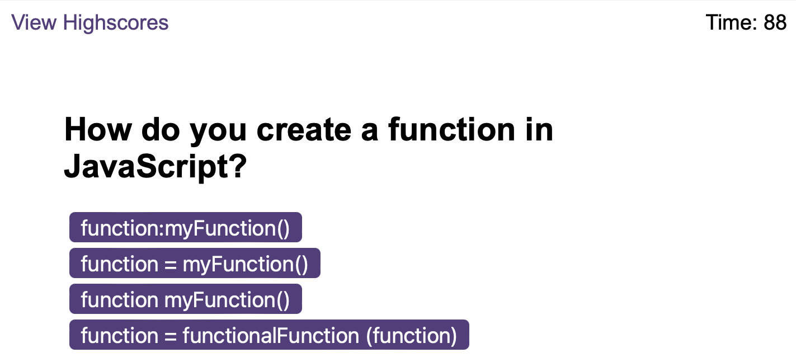

## Coding Quiz

## **What**
A quiz using JavaScript to create a mulitple choice question quiz with an accompanying countdown timer.

Here is the the acceptance criteria which the project needed to adhere to:

    - GIVEN I am taking a code quiz
    - WHEN I click the start button
    - THEN a timer starts and I am presented with a question
    - WHEN I answer a question
    - THEN I am presented with another question
    - WHEN I answer a question incorrectly
    - THEN time is subtracted from the clock
    - WHEN all questions are answered or the timer reaches 0
    - THEN the game is over
    - WHEN the game is over
    - THEN I can save my initials and score

## **How**
The application needed to begin upon clicking the 'start quiz' button and had to generate random questions for the user to answer. 

This then triggers a series of multiple choice questions for the user to answer, whereby user's score increases with every correct answer, and they are penalized for each wrong answer with a ten second deduction from the app's timer (originally set at 90 seconds).

Once the user has answered all questions, they reach an end page where they can view their score, input their initials and submit this to the high score page of the app.

## **Result**

The GitHub repository link:

https://github.com/Nikki1162/coding-quiz

The live application:

https://nikki1162.github.io/coding-quiz/